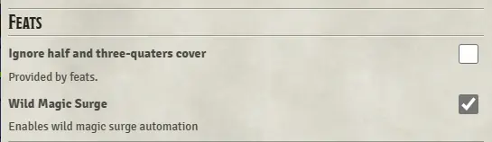
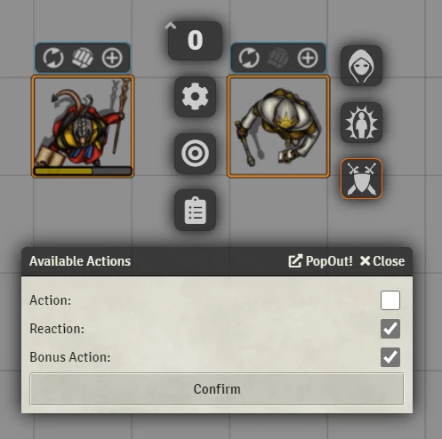

# DnD5e Helpers
Little helpers for little 5e tasks.

## Known Issues
- Automatic proficiency for *specific* items (such as "Daggers" or "Clubs") has not been fully upgraded for 0.8.

## Current Features

### Automatic Wild Magic Surge
- To enable, select a Surge option from the Feature Helpers config tab and then set the special trait for actors that should surge on casting a spell.
 
 
- Triggers on *any* reduction in current spell slots from a character with the 'Wild Magic Surge' special trait
- Optional homebrews
   - More Surges - a surge triggers on a roll <= spell level. Also recharges Tides of Chaos.
   - Volatile Surges - Similar to More, but adds 1d4 to the spell level if Tides of Chaos has been expended
   - The homebrew variants look for the designated Tides of Chaos feature and expects it to have "X uses per long rest". Will also recharge an actor resource of the same name, if present.
- Blind draw surge table results, which hides the results of the surge from the players.

### Combat Action Management
- Action HUD added to tokens during combat, tracking their Action, Bonus Action and Reaction.
  - Positive action cost items will mark the corresponding action as used.
  - Negative action cost items will refund the corresponding action. Ex. Action Surge configured as "-1 Action".
- Used actions will reset at the beginning of the combatant's turn.
- Additional control added to the token HUD during combat to manually adjust actions.

### Legendary Action Reset on Start of Turn
- All legendary action uses of a creature will reset to their max on the start of their turn in combat.

### Lair and Legendary Action Helpers
- Prompts GM with available legendary actions in-between combatant turns
- Prompts GM with available lair actions at initiative count 20
- Tracks current available uses 

### Recharge Abilities on Start of Turn
- GM only
- For abilities with a "d6 recharge" on every turn.
- Configurable to hide the roll, or to roll at the end of a combatants turn instead of the start.

### Diagonal Template Scaling
- _I cast...Firesquare!_
- Scales line, cone, and circle type templates upon placement to better fit to the 5/5/5 diagonal rule.
- Line and cone scaling can be enabled independently from circle scaling.
  - Circle templates less than 1 grid unit in radius will not be converted. These small templates are often useful for creating quick token-like markers on the board or used for macros which need the centerpoint maintained.

### Cover Calculator
- When a user with a selected token targets another token with the designated hotkey held, the target's cover will be calculated following the rules presented in DMG pg. 251
- A message in chat will be posted concerning the target's cover in relation to the selected token(s).
- Prioritizes walls, specially flagged tiles, then tokens.
  - Tiles have a new option in their configuration dialog that sets the cover granted by them.
  - Two tiles are now included from game-icons.net that are configured automatically for half and three-quarters cover in modules/dnd5e-helpers/assets/cover-tiles.
- Has two modes for cover in relation to walls: Center Point and Four Corner. Cover from tiles and tokens are (currently) only calculated from Center Point.
  - Center Point - a target token's cover is based on foundry's player vision rendering (center point of self to 4 corners of target)
  - Four Corner - direct implementation of DMG rules, where vision is computed from each occupied grid point and the corner granting the target the least cover is chosen.
  - A more detailed discussion of this can be found on our Wiki
- A new method has been added as ``Token#computeTargetCover``. The usage of it has been detailed in the source code, but is still a work in progress. Basic usage is calling with no arguments with both a selected and targeted token. The return value is a promise of the raw cover data from visibility tests.

### Cover Application
- Manual setting adds chat buttons to click to cycle between different cover effects.
- Automatic will automatically apply the relevant effect but still generate the chat message for manual adjustment.
- This cover bonus is applied onto the *targeter* not the target and is a -2,-5,-40 negative for any attack rolls.
- The cover bonus to Dexerity saves are not dealt with.
- A new special trait has been added to indicate if the actor should ignore cover (e.g. Sharpshooter or Spell Sniper)
- Alternatively, a flag of `"dnd5e", "helpersIgnoreCover"` will flags the token as ignoring cover, for use with Spell Sniper or Sharpshooter ( will also remove melee cover effects ).
- 

### Auto Proficiency Detection
- Will automatically mark a newly added weapon, armor or tool 'proficient' if it is part of the actor's listed proficiencies
- Note: specific weapon or armor proficiencies should match their intended name (ex. "Dagger" proficiency for a weapon called"Dagger").
- For Tools, it tries to match the tool name with the proficiency (Ex. "Flute" will not be detected by checking "Musical Instrument" Tool Proficiency textbox, but "Musical Instrument: Flute" will. To detect "Flute", add "Flute" as a special Tool Proficiency).

### Auto Regeneration
- Automatically checks actors with the Regeneration or Self-Repair features
- Searches the these features for the phrase "X hit points", where X can be a static value or a dice formula
- At the start of their turn, prompts the GM for a roll for the regen and auto applies the healing

### Regen Blocking
- Feature to prevent the auto regen popup
- Matches and active effect of the specified name (case specific)

### Undead Fortitude
- Automatically checks actors with the Undead Fortitude feature
- When they are reduced to 0hp it will prompt the GM to choose the type of damage that was applied
- Then prompts the GM for a Con save for that actor, and will auto heal the NPC if the roll beats the save needed
- There are two settings for levels of checks:
    - Quick saves will just measure the change in hp and will not measure "overkill"
    - Advanced saves will query the GM for the amount of damage taken as a more complex system

### Open Wounds
- Rolls on an "Injury Table" when specific customisable criteria are met; currently: 
  - Failing a Death Saving Throw by 5 or more
  - Getting critically hit (customisable value)
  - Falling to 0hp
  - Falling to 0hp from a Great Wound

### Great Wound Detection
- Triggers on a reduction of >50% of a token/actor's health.
- Configurable Great Wound table to draw from.
- This will ask for a Great Wound Roll, and will prompt the owner of the token to make a Con Save then roll on the table

### Minimum Roll Dice Modifier
- New die roll modifier added: `mr` (minimum roll)
  - Example: `1d6mr2` will replace any rolls less than 2 with 2s, `1d2mr10` will replace any rolls less than 10 with 10!
  - Spell and Cantrip scaling works as expected. `1d6mr2` in the scaling field will ensure upcasting of Burning Hands will replace 1s with 2s. Cantrip scaling can be left blank in most cases (as per stock dnd5e operation) as the first damage field of the cantrip will be used as the scaling formula.
  - Note: There is no toggle option for this functionality.

## Debug Setting
- Option to add debug logs for troubleshooting

## Authors:
- honeybadger (https://github.com/trioderegion)
- Kandashi (https://github.com/kandashi)
- hugoprudente (https://github.com/hugoprudente)
- kekilla (https://github.com/kekilla0)
