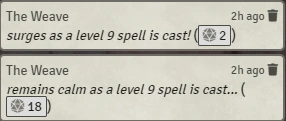
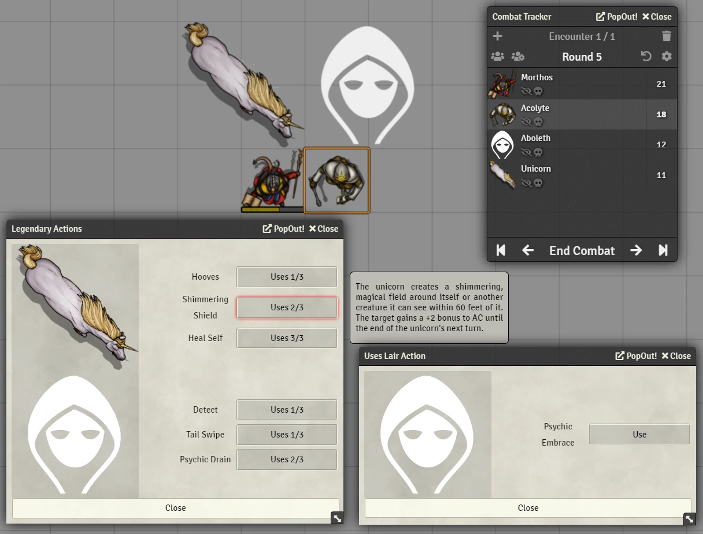
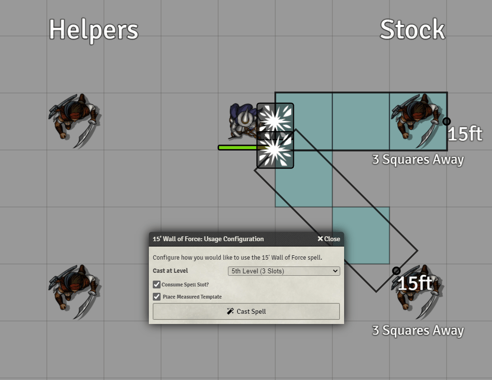
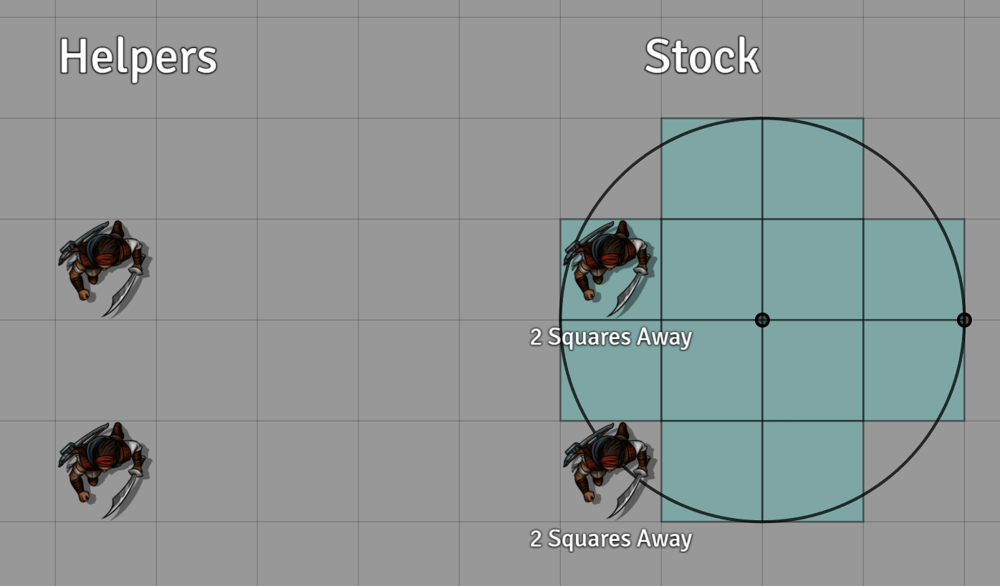
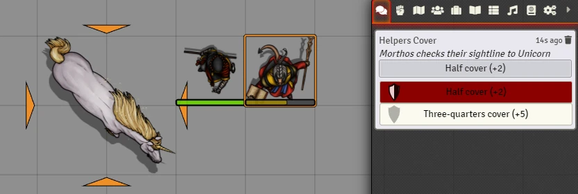
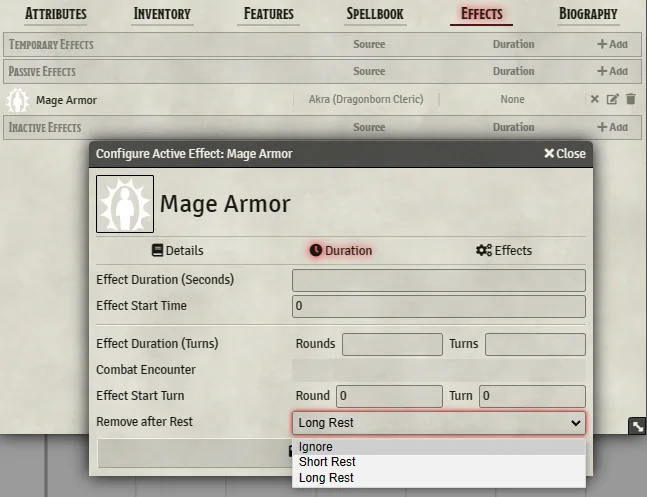

# DnD5e Helpers

Little helpers for little 5e tasks.

### Compatibility Notes
- v3.0.4 (legacy 0.8.x generation): Requires dnd5e system version 1.5.5 or greater.

## Current Features

### Automatic Wild Magic Surge

- To enable, select a Surge option from the Feature Helpers config tab and then set the special trait for actors that should surge on casting a spell.

- Triggers on _any_ reduction in current spell slots from a character with the 'Wild Magic Surge' special trait
- Optional homebrews
  - More Surges - a surge triggers on a roll <= spell level. Also recharges Tides of Chaos.
  - Volatile Surges - Similar to More, but adds 1d4 to the spell level if Tides of Chaos has been expended
  - The homebrew variants look for the designated Tides of Chaos feature and expects it to have "X uses per long rest". Will also recharge an actor resource of the same name, if present.
- Blind draw surge table results, which hides the results of the surge from the players.

### Combat Action Management

- Action HUD added to tokens during combat, tracking their Reaction, Action, and Bonus Action (left to right).
  - Positive action cost items will mark the corresponding action as used.
  - Negative action cost items will refund the corresponding action. Ex. Action Surge configured as "-1 Action".
  - Items with usage of "Action" will be interpretted as a Reaction when used on another actor's turn.
- Used actions will reset at the beginning of the combatant's turn.
- Additional control added to the token HUD during combat to manually adjust actions.
- Used actions can optionally be displayed as status effects for easier tracking.
- When the action HUD is visible, clicking on an action icon will consume that action, clicking a used action will restore it for use.
- Note: This management is for display purposes only and will not interfere with item use.

#### Added `Token` Methods

- `setActionUsed(actionType, overrideCount = undefined)`: Sets the provided action type as used for this token and will update the management HUD accordingly.
  - `actionType` {String}: valid values are `action`, `bonus`, and `reaction`. Indicates which action type to modify uses for.
  - `overrideCount` {Number = `undefined`}: optionally sets how many times this action has been used. If set to `0`, restores the action as unsued for combat HUD display.

  - `return value` {Object | `false`}: Current set of used actions and their counts, or `false` if any part of the update failed -- typically due to incorrect action type string.

https://user-images.githubusercontent.com/14878515/131264314-d4017b8a-fa7a-4bf8-8f62-795145441605.mp4

### Legendary Action Reset on End of Turn

- All legendary action uses of a creature will reset to their max on the end of their turn in combat.
  - Note: RAW indicates this should be at the beginning of their turn, but due to timing issues with the legendary action helper, this has been moved to the end of the turn and has no mechanical effect on gameplay.

### Lair and Legendary Action Helpers

- Prompts GM with available legendary actions in-between combatant turns.
- Prompts GM with available lair actions at the creature's designated lair initiatve.
- Tracks current available uses of legendary actions.
- A creature's legendary and lair actions will be indexed when first added to the tracker. Only items with an activation cost of "Legendary Action" or "Lair Action" will be indexed.

### Recharge Abilities on Start of Turn

- GM only
- For abilities with a "d6 recharge" on every turn.
- Configurable to hide the roll, or to roll at the end of a combatants turn instead of the start.

### Diagonal Template Scaling

- _I cast...Firesquare!_
- Scales line, cone, and circle type templates upon placement to better fit to the 5/5/5 diagonal rule.
- Line and cone scaling can be enabled independently from circle scaling.
  - Circle templates less than 1 grid unit in radius will not be converted. These small templates are often useful for creating quick token-like markers on the board or used for macros which need the centerpoint maintained.

### Cover Calculator

- When a user with a selected token targets another token with the designated hotkey held, the target's cover will be calculated following the rules presented in DMG pg. 251
- A message in chat will be posted concerning the target's cover in relation to the selected token(s).
- Prioritizes walls, tiles, and then tokens.
  - Walls, tiles, and tokens have a new option in their configuration dialog that sets the cover granted by them.
  - Two tiles are now included from game-icons.net that are configured automatically for half and three-quarters cover in modules/dnd5e-helpers/assets/cover-tiles.
- Has two modes for cover in relation to walls: Center Point and Four Corner. Cover from tiles and tokens are (currently) only calculated from Center Point.
  - Center Point - a target token's cover is based on foundry's player vision rendering (center point of self to 4 corners of target)
  - Four Corner - direct implementation of DMG rules, where vision is computed from each occupied grid point and the corner granting the target the least cover is chosen.
  - A more detailed discussion of this can be found on our Wiki
- Added `Token#setCoverValue` which accepts 0-3 (no, half, 3/4, and full cover, respectively). Can be used to change a token's provided cover; e.g. when prone or dead.

#### A Note on Module Interactions

Helpers provides built-in functionality for managing cover in a simple manner. Other modules may interact with Helper's output, or supercede it entirely. If this is the case, please consult the other module's instructions or readme and configure the Helpers cover calculator settings appropriately.

https://user-images.githubusercontent.com/14878515/131264330-7cc644e9-a991-41cb-9f7f-875bebabfed7.mp4

### Cover Application

- Manual setting adds chat buttons to click to cycle between different cover effects.
- Automatic will automatically apply the relevant effect but still generate the chat message for manual adjustment.
- This cover bonus is applied onto the _attacker_ not the target and is a -2,-5,-40 penalty for any attack rolls.
- The cover bonus to Dexerity saves are not handled.
- A new special trait has been added to indicate if the actor should ignore certain levels of cover (e.g. Sharpshooter, Spell Sniper, Wand of the Warmage)
- Alternatively, a flag of `"dnd5e", "helpersIgnoreCover"` will flags the token as ignoring cover, for use with Spell Sniper or Sharpshooter ( will also remove melee cover effects ). Said flags accepts values of 0,1,2 or 3 which allows the actor to ignore no, half, three-quarters or full cover respectively. To ensure legacy compatibility values of true are also accepted but identical in functionality to a value of 2.
- Cover penalties can be optionally removed at the end of the token's turn.

### Rest Effects
- Adds an additional option to Active Effects that allows removal of effect on a short or long rest.

### Auto Regeneration

- Automatically checks actors with the Regeneration or Self-Repair features
- Searches the these features for the phrase "X hit points", where X can be a static value or a dice formula
  - The search phrase is localized for your supported language.
- At the start of their turn, prompts the GM for a roll for the regen and auto applies the healing

### Regen Blocking

- Feature to prevent the auto regen popup
- Matches and active effect of the specified name (case specific)

### Undead Fortitude

- Automatically checks actors with the Undead Fortitude feature
- When they are reduced to 0hp it will prompt the GM to choose the type of damage that was applied
- Then prompts the GM for a Con save for that actor, and will auto heal the NPC if the roll beats the save needed
- There are two settings for levels of checks:
  - Quick saves will just measure the change in hp and will not measure "overkill"
  - Advanced saves will query the GM for the amount of damage taken as a more complex system

### Open Wounds

- Rolls on an "Injury Table" when specific customisable criteria are met; currently:
  - Failing a Death Saving Throw by 5 or more
  - On a critical hit (enemy must be targeted; critical range specified by special traits)
  - Falling to 0hp
  - Falling to 0hp from a Great Wound

### Great Wound Detection

- Triggers on a reduction of >50% of a token/actor's health.
- Configurable Great Wound table to draw from.
- This will ask for a Great Wound Roll, and will prompt the owner of the token to make a Con Save then roll on the table

## Debug Setting

- Option to add debug logs for troubleshooting

## Authors:

- honeybadger (https://github.com/trioderegion)
- Kandashi (https://github.com/kandashi)
- kekilla (https://github.com/kekilla0)
